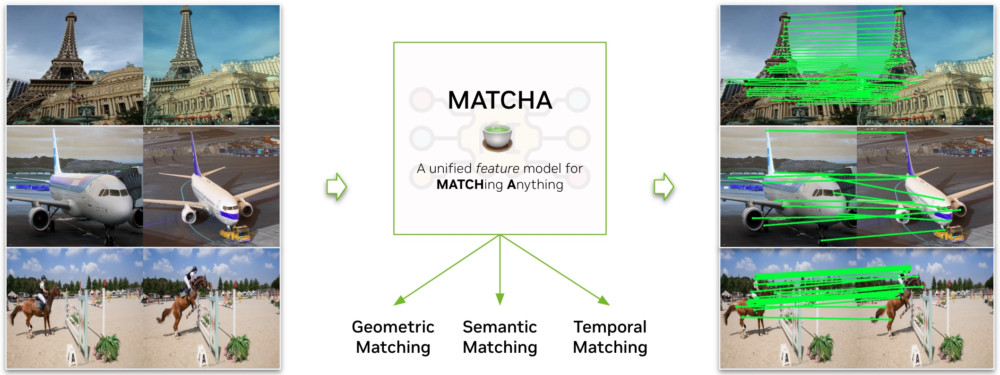

# Towards Matching Anything

Code release for **MATCHA:Towards Matching Anything**  [[Paper](https://arxiv.org/abs/2501.14945) | [Project Page](https://feixue94.github.io/matcha-project/)]



## Installation

Clone this repository and create a conda environment with the following commands:

```
# Clone this repo
git clone git@github.com:nv-dvl/matcha.git

# Create conda env
conda env create -f environment.yml
conda activate matcha

# Install this repo
pip install -e .
```

## Pretrained model

Download our [matcha_pretrained.pth](https://drive.google.com/file/d/17p0-ne4B9H60cC_AF6G284SetuImDUDO/view?usp=sharing)
and create ``weights/`` folder and place it there.

## Put MATCHA in your project

You can use MATCHA in your project by importing the `matcha` package. For example, to use the MATCHA model for geometric or semantic
matching, you can do:

```python
import torch
from matcha.feature.matcha_feat import MatchaFeature
from matcha.matcher.base_matcher import BaseMatcher

device = torch.device("cuda" if torch.cuda.is_available() else "cpu")

# Initialize model
pretrained_path = "weights/matcha_pretrained.pth"
model = MatchaFeature(config={"keypoint_method": "disk", "image_size": (512, 512)})
model.load_state_dict(torch.load(pretrained_path), strict=False)

img0_out = model.load_image("assets/examples/sacre_coeur_A.png")
img1_out = model.load_image("assets/examples/sacre_coeur_B.png")

# Extract dense matcha features
feat0 = model.describe(img0_out["image_tensor"].to(device)[None], semantic_mode=True)
feat1 = model.describe(img1_out["image_tensor"].to(device)[None], semantic_mode=True)

# Extract sparse keypoints and descriptors
kpts0, descs0 = model.detect_and_describe(img0_out["image_tensor"].to(device)[None])
kpts1, descs1 = model.detect_and_describe(img0_out["image_tensor"].to(device)[None])

matcher = BaseMatcher(model, device)

# Perform geometric matching
geo_matches_out = matcher(
    data0={
        "image": img0_out["image_tensor"].to(device)[None]},
    data1={
        "image": img1_out["image_tensor"].to(device)[None],
    },
    with_keypoint_detection=True,
)

# Perform semantic matching with query points
sem_matches_out = matcher(
    data0={
        "image": img0_out["image_tensor"].to(device)[None],
        "keypoints": torch.randint(low=0, high=255, size=(10, 2)).float().to(device)[None],  # Example keypoints
    },
    data1={
        "image": img1_out["image_tensor"].to(device)[None],
    },
    with_keypoint_detection=False,
)

```

## Demos

Try out our interactive demo for matching anything with:

```
python3 demo_gradio.py
```

Try out our demo for geometric matching with:

```
python3 -m scripts.geometric_demo
```

Try out our demo for semantic matching with:

```
python3 -m scripts.semantic_demo
```

## Data

Preparation for datasets used for training and testing is [here](data/data.md)

## Evaluation

### Semantic matching

#### PF-PASCAL, PF-WILLOW, and Spairs

```
python3 -m matcha.benchmark.run_benchmarks --weight_path path_to_weight --dataset_path path_to_pfpascal/pf-willow/spairs  --benchmark pfpascal/pfwillow/spairs --soft_eval --semantic_mode --image_size 512 512
```

### Geometric matching

#### Megadepth, Scannet, Aachen, and HPatches

```
python3 -m matcha.benchmark.run_benchmarks --weight_path path_to_weight --dataset_path path_to_megadepth/scannet/aachen/hpatches  --benchmark megadepth1500/scannet1500/aachen1500/hpatches_matching --soft_eval --scale_factor 32 --keypoint_method disk/superpoint
```

### Temporal matching

#### TAPVID

```
python3 -m matcha.benchmark.run_benchmarks --weight_path path_to_weight --dataset_path path_to_megadepth/scannet/aachen/hpatches  --benchmark tapvid --soft_eval --image_size 512 512
```

### Evaluation of custom features

Please use the template in `matcha/feature/custom_feature.py` to implement your own feature extraction method and add
the custom feature to `matcha/feature/__init__.py`.

```python
from typing import Mapping, Any
import torch

from .base_feature import BaseFeature


class CustomFeature(BaseFeature):
    # Update the default configuration as needed
    default_config = {
        "topK": 4096,
        "upsampling": 0,
        "image_size": None,
        "scale_factor": 1,
        "keypoint_method": None,
        "max_length": None,
        "device": "cuda" if torch.cuda.is_available() else "cpu",
    }

    def __init__(self, config=None):
        super().__init__(
            config={**self.default_config, **config, } if config else self.default_config,
            name="CustomFeat")
        # Initialize your custom model here
        self.model = None  # Custom model should be defined here

    def describe(self, img: torch.Tensor, **kwargs) -> torch.Tensor:
        # Define how to extract features from the image
        pass

    def detect_and_describe(self, img: torch.Tensor, **kwargs):
        # Define how to detect keypoints and describe the image
        pass

```

## Training

Due to other priorities, the authors have constraint capacity to prepare the training guidance. We refer the users to the paper for training details.

## Citation
If you use our method in your research, please cite:
```
@inproceedings{xue2025matcha,
  title={MATCHA: Towards matching anything},
  author={Xue, Fei and Elflein, Sven and Leal-Taix{\'e}, Laura and Zhou, Qunjie},
  booktitle={Proceedings of the Computer Vision and Pattern Recognition Conference},
  pages={27081--27091},
  year={2025}
}
```

